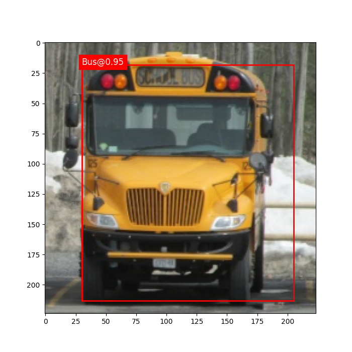
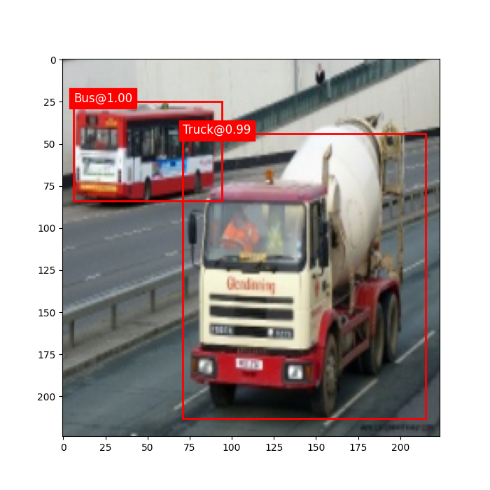
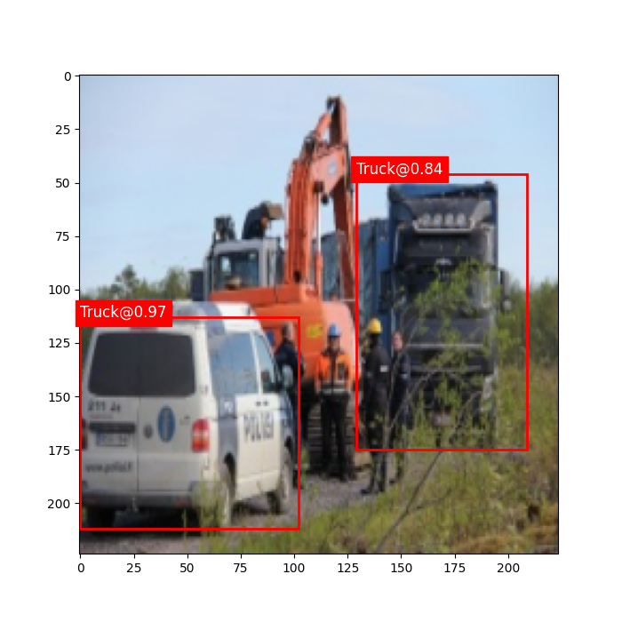

# Faster R-CNN Object Detection Project

This repository contains an implementation of Faster R-CNN for object detection using PyTorch framework, focusing on a custom modification where only the Region of Interest (RoI) head is unfrozen for fine-tuning. The goal is to leverage a pre-trained model while adjusting the classifier to fit a specific number of classes, providing efficient and high-performance detection on a custom dataset.

## Model Overview

Faster R-CNN (Region-based Convolutional Neural Network) is a state-of-the-art model for object detection that integrates both region proposal and object classification into a unified network, which significantly improves the speed and accuracy of detection tasks. By utilizing a Region Proposal Network (RPN) to suggest regions of interest, Faster R-CNN minimizes the need for external region proposals, streamlining the detection pipeline.

- **Paper**: [Faster R-CNN: Towards Real-Time Object Detection with Region Proposal Networks](https://arxiv.org/abs/1506.01497)
- **Authors**: Shaoqing Ren, Kaiming He, Ross B. Girshick, and Jian Sun

## Implementation Details

This implementation uses a Faster R-CNN model with a ResNet-50 backbone and a Feature Pyramid Network (FPN) for feature extraction. The following adjustments were made:

- **Backbone**: ResNet-50 with FPN, pre-trained on the COCO dataset.
- **Custom Classes**: The model’s RoI head classifier is modified to fit the desired number of classes.
- **Fine-Tuning**: All layers are frozen except the RoI head, specifically the box predictor, allowing only the classification layers to learn from the custom dataset. This approach leverages pre-trained features while adjusting for new classes with minimal training time.

### Example Output

Below is an example of the output with bounding boxes and labels drawn over the detected objects:

| Image 1                    | Image 2                    | Image 3                    |
|----------------------------|----------------------------|----------------------------|
|  |  |  |

## Requirements

- Python 3.8+
- torch==2.4.1+cu118
- torchvision==0.19.1+cu118
- torch_snippets==0.545
- pillow==10.2.0
- scikit-learn==1.3.2
- torchinfo==1.8.0
- matplotlib==3.7.5

Install the necessary dependencies with:

```bash
pip install -r requirements.txt

